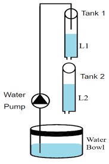

## Introduction

<b>Discipline | <b> Electrical Engineering 
:--|:--|
<b> Lab | <b> **Control and Instrumentation Lab**
<b> Experiment|     <b> **Two Tank Water Level Control and Experiment 5**

### About the Experiment 
**System description**

The Coupled-Tank plant is a "Two-Tank" module consisting of a pump with a water basin and two tanks. Industrial applications of such Coupled-Tank configurations
can be found in the processing system of petro-chemical, paper making, water treatment plants etc. In this experiment, the Coupled-Tank system is used in two different
configurations, namely configuration-1 and configuration-2. 

In configuration-1, the control task involves accurately following a specified trajectory for the water level in the top tank (i.e. tank-1)
based on the applied voltage to the pump. 

In configuration-2, the control task is to accurately trace a specified trajectory for the water level in the bottom tank (i.e. tank-2) using the water flow discharged from the top tank (i.e. tank-1).

Proportional-plus-Integral-plus-Feedforward based water level controllers have been used in the present experiment. Depending on the tanks’ configuration and coupling,
the purpose of this experiment is to track the water level in either tank-1 or tank-2.
 			  

 
<figcaption >Fig 1. The Coupled-Tank Plant </figcaption>

<b>Subject matter expertise | <b> **Prof. Alok Kanti Deb**
:--|:--|
<b> Institute | <b>  **Indian Institute of Technology Kharagpur**
<b> Email id|     <b>  **alokkanti@ee.iitkgp.ac.in**
<b> Department |  **Department of Electrical Engineering**
<b>Webpage| <b> http://www.iitkgp.ac.in/department/EE/faculty/ee-alokkanti

### Contributors List

SrNo | Name | VLabs Developer or Integration Engineer | Designation | Department| Institute
:--|:--|:--|:--|:--|:--|
1 | **Piyali Chattopadhyay** | Developer | Project Scientist | Department of Electrical Engineering | IIT Kharagpur | 
2 | **Subhasis Mahata** | Integration Engineer | Senior Project Scientist | Department of Mechanical Engineering | IIT Kharagpur |