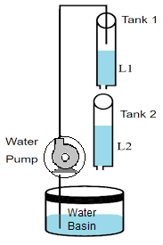

## Introduction

<b>Discipline | <b> Electrical Engineering 
:--|:--|
<b> Lab | <b> **Control and Instrumentation Lab**
<b> Experiment|     <b> **Two Tank Water Level control and Experiment 5**

### About the Experiment 
**System description**

The Coupled-Tank plant is a "Two-Tank" module consisting of a pump with a water basin and two tanks.To name a few,industrial applications of such Coupled-Tank configurations can be found in the processing system of petro-chemical, paper making, and/or water treatment plants.In this experiment, the Coupled-Tank system is used in two different configurations, namely configuration-1 and configuration-2. In configuration-1, the control challenge is to track to a desired trajectory the water level in the top tank (i.e. tank-1) from the voltage applied to the	pump. The coupled-tank system in configuration-2 is an example of state coupling. In configuration-2, the control challenge is to track to a desired trajectory the water level in the bottom tank (i.e.tank-2) from the water flow coming out of the top tank (i.e. tank-1)
Proportional-plus-Integral-plus-Feedforward-based water level controllers are used In the present experiment.Depending on the tanks’ configuration and coupling,the purpose of the laboratory session is to regulate and track the water level in either tank-1 and/or tank-2.

 
<figcaption style="color:blue">Fig1.The Coupled-Tank Experiment </figcaption>

<b>Name of Developer | <b> **Prof. Alok Kanti Deb**
:--|:--|
<b> Institute | <b>  **Indian Institute of Technology Kharagpur**
<b> Email id|     <b>  **alokkanti@ee.iitkgp.ac.in**
<b> Department |  **Department of Electrical Engineering**
<b>Webpage| <b> http://www.iitkgp.ac.in/department/EE/faculty/ee-alokkanti

### Contributors List

SrNo | Name | VLabs Developer or Integration Engineer | Designation | Department| Institute
:--|:--|:--|:--|:--|:--|
1 | **Piyali Chattopadhyay** | Developer & Integration | Project Scientist | Department of Electrical Engineering | IIT Kharagpur | 
