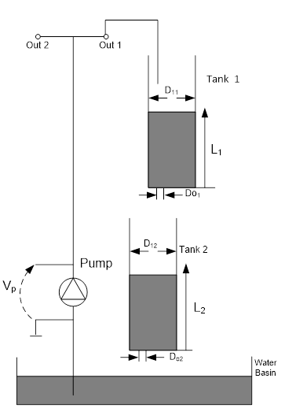
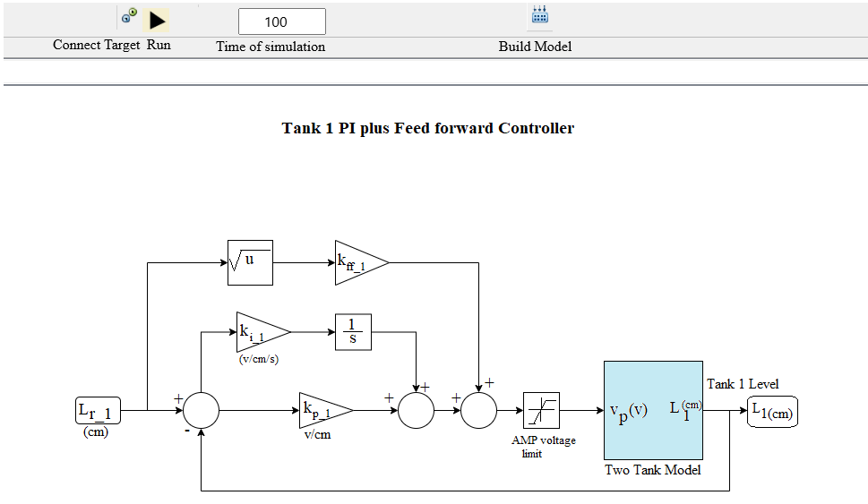
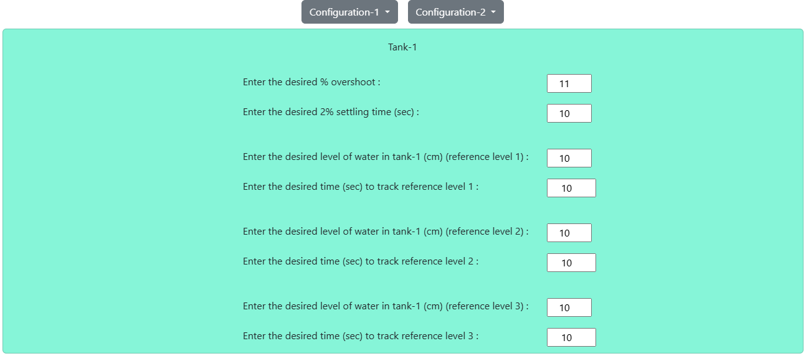
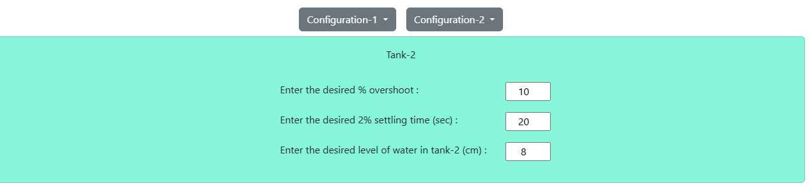
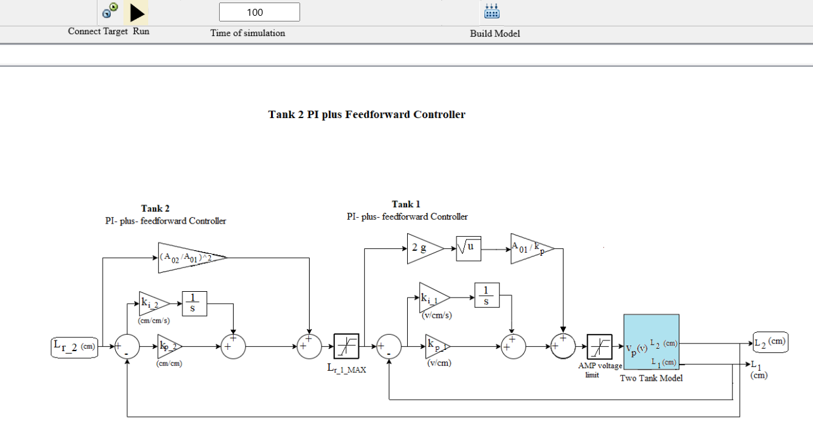

### Procedure

  
<b>Fig. 1. Schematic of the Coupled-Tank plant</b> 

 								

<b>Steps to perform the simulation</b> 
<ol type="1">

<li>First click on "Configuration-1" button. Click on 'Level Response'.</li> 

<li>Enter the desired value of percentage overshoot , settling time (sec) for 2 percent error band and desired level of water (cm) for tank-1. Here the default values are 11 percent overshoot, 10 sec settling time
and 10 cm water level for tank-1. Set the desired time of simulation. 100 &le; Desired time of simulation &le; 200.</li> 

  
<b>Fig. 2. Tank 1 configuration for water level response</b>

  

<li>Configuration-1 (Level Response) : 1 &le; &percnt; Overshoot &le; 11, 1 &le; 2 &percnt; Settling time &le; 10, 1 &le; Desired water level &le; 15 cm.</li> 

<li>Click on 'Build Model' icon to build the plant model (tank-1) successfully. Click on 'Connect Target' icon, an alert message will be shown . Click on 'Run' button to start the
simulation and observe tank-1 level response. Click on 'OK' button beside the 'Download' button. Plot can be downloaded by clicking on 'Download' button.</li> 

 
<b>Fig. 3. Tank 1 PI plus Feedforward controller</b> 

  

<li>Click on "Configuration-1" button again. Click on 'Level Tracking'. Three different reference levels (cm) of water
and the duration (sec) of tracking them need to be entered. Set the desired time of simulation. 100 &le; Desired time of simulation &le; 200.</li> 

<li>Configuration-1 (Level Tracking) : 1 &le; &percnt; Overshoot &le; 11, 1 &le; 2 &percnt; Settling time &le; 10, 1 &le; Each reference water level &le; 15 cm.</li> 

 
<b>Fig. 4. Tank 1 configuration for water level tracking</b>

  

<li>Enter the desired value of percentage overshoot , settling time (sec) for 2 percent error band for tank-1. 
Enter desired level of water (cm) as reference level 1 and desired time (sec) to track reference level 1.</li> 	  

<li>Enter desired level of water (cm) as reference level 2 and desired time (sec) to track reference level 2.</li> 

<li>Enter desired level of water (cm) as reference level 3 and desired time (sec) to track reference level 3.</li> 

<li>Click on 'Build Model' icon to build the plant model (tank-1) successfully. Click on 'Connect Target' icon, an alert message will come . Click on 'Run' button to start the
simulation and observe tank-1 level tracking plot. Click on 'OK' button beside the 'Download' button. Plot can be downloaded by clicking on 'Download' button.</li> 

<li>Now click on "Configuration-2" button. Click on 'Level Response'.</li> 

<li>Enter the desired value of percentage overshoot , settling time (sec) for 2 percent error band and desired level of water (cm) for tank-2. Here the default values are 10 percent overshoot, 20 sec settling time
and 8 cm water level for tank-2. Set the desired time of simulation. 100 &le; Desired time of simulation &le; 200.</li> 

<li>Configuration-2 (Level Response) : 1 &le; &percnt; Overshoot &le; 10, 1 &le; 2 &percnt; Settling time &le; 20, 1 &le; Desired water level &le; 15 cm.</li> 

  
<b>Fig. 5. Tank 2 configuration for water level response</b>

  

<li>Click on 'Build Model' icon to build the plant model (tank-2) successfully. Click on 'Connect Target' icon, an alert message will be shown . Click on 'Run' button to start the
simulation and observe tank-2 level response. Click on 'OK' button beside the 'Download' button. Plot can be downloaded by clicking on 'Download' button.</li> 

 
<b>Fig. 6. Tank 2 PI plus Feedforward controller</b>

  

<li>Click on "Configuration-2" button again. Click on 'Level Tracking'. Three different reference levels (cm) of water
and the duration (sec) of tracking them need to be entered. Set the desired time of simulation. 100 &le; Desired time of simulation &le; 200.</li> 

<li>Configuration-2 (Level Tracking) : 1 &le; &percnt; Overshoot &le; 10, 1 &le; 2 &percnt; Settling time &le; 20, 1 &le; Each reference water level &le; 15 cm.</li> 	

<li>Enter the desired value of percentage overshoot , settling time (sec) for 2 percent error band for tank-2. 
Enter desired level of water (cm) as reference level 1 and desired time (sec) to track reference level 1.</li> 	  

<li>Enter desired level of water (cm) as reference level 2 and desired time (sec) to track reference level 2.</li> 

<li>Enter desired level of water (cm) as reference level 3 and desired time (sec) to track reference level 3.</li> 

<li>Click on 'Build Model' icon to build the plant model (tank-2) successfully. Click on 'Connect Target' icon, an alert message will be shown . Click on 'Run' button to start the
simulation and observe tank-2 level tracking plot. Click on 'OK' button beside the 'Download' button. Plot can be downloaded by clicking on 'Download' button.</li> 

</ol>