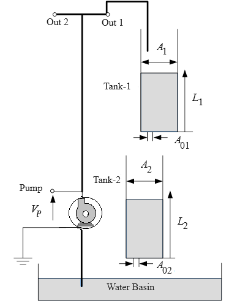

### Procedure

**Schematic of the Coupled-Tank Plant**

            

**Steps to perform the simuation**

1. At first click on "Configuration-1" button and enter the desired value of percentage overshoot and settling time for 2percent error band for tank-1.Here default value is 11 percent overshoot and 10sec settling time for tank-1.

            

  
2. Click on 'Build Model' icon to build the plant(tank-1) successfully.Then click on 'Connect Target' icon,an alert message will come .Now click on 'Run' button to start the simulation and observe tank-1 level response.Click on 'OK' button beside the 'Download' button.Plot can be downloaded by clicking on 'Download' button.

            

					 				 
3. Click on "Configuration-2" button now and enter the desired value of percentage overshoot and settling time for 2percent error band for tank-2.Here default value is 10 percent overshoot and 20sec settling time for tank-2.

4. Click on 'Build Model' icon to build the plant(tank-2)successfully.Then click on 'Connect Target' icon,an alert message will come .Now click on 'Run' button to start the simulation and observe tank-2 level response.Click on 'Ok' button.
  