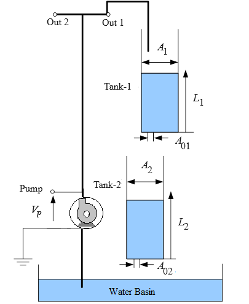
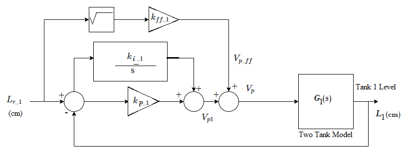

# Theory

The first step in the analysis of control system is to derive its mathematical model to understand the working of the complete system.

<b>The Plant (Coupled-Tank) :</b>

The Coupled-Tank plant is a "Two-Tank" module consisting of a pump with a water basin and two tanks. The two tanks are mounted on the front plate such that flow from the first (i.e. upper) tank can flow through an outlet orifice located at the bottom of the tank, into the second (i.e. lower) tank. Flow from the second tank flows into the main water reservoir. The pump thrusts water vertically to two quick-connect orifices "Out1" and "Out2". The two system variables are directly measured by pressure sensors and available for feedback.
They are namely the water levels in tanks 1 and 2. Proportional-plus-Integral-plus-Feedforward based water level controller has been used here.

The Coupled-Tank system is used in two different configurations, namely configuration-1 and configuration-2.

In configuration-1, the control task involves accurately following a specified trajectory for the water level in the top tank (i.e. tank-1) based on the applied voltage to the pump.

In configuration-2, the control task is to accurately trace a 
specified trajectory for the water level in the bottom tank (i.e. tank-2) using the water flow discharged from the top tank (i.e. tank-1).

				

<b>Fig 1: Schematic of the Coupled-Tank Plant</b>

<b>Configuration-1 :</b>

In configuration-1, a single-tank system consisting of the top tank (i.e. tank-1), is considered. The designed closed-loop system is to control the water level (or height) inside tank-1 via the commanded pump voltage. It is based on a Proportional-plus-Integral-plus-Feedforward scheme.

In tank-1 the water height behaviour should satisfy the following design performance 
requirements :

1. The operating level (a.k.a. equilibrium height) <i>L</i>10 , in tank-1 should be as follows :

<i>L</i>10 = 10 cm (this can be varied)

2. The percentage overshoot should be less than 11&percnt;, i.e. :
$$ PO_{1} \leq 11\% $$

3. The 2&percnt; settling time should be less than 10 seconds, i.e. :
$$ t_{s\_1} \leq 10 [ s ] $$

4. The response should have no steady-state error.						

The open loop transfer function of tank-1 for configuration-1 (voltage to level) is :

$$ G_1(s) = \frac{\frac{k_p}{A_{01}}\sqrt{\frac{2L_{10}}{g}}}{(\frac{A_{1}}{A_{01}}\sqrt{\frac{2L_{10}}{g}}) s+1} .... (1) $$

Where,

<i style = "font-family:'Bodoni MT'">kp</i> = Pump volumetric flow constant

<i>A</i>01 = Tank-1 outlet cross sectional area

<i>A</i>1 = Tank-1 inner cross section area

<i style = "font-family:'calibri'">g</i> = Gravitational constant

Equation (1) is derived from the nonlinear equation of configuration-1 (equation-2) and linearizing it with respect to an operating point 
(<i>L</i>10, <i>Vp0</i>)
(equation 3)

$$ \frac{d \ (change\ in \ volume\ in\ tank \ 1)}{dt} = F_{in} - F_{out} $$

$$ \frac{dL_1}{dt}= \frac{k_p V_p}{A_1}- \frac{A_{01} \sqrt{2gL_1}}{A_1} ...(2)$$ 

$$Nonlinear \ equation \ of \ tank-1$$

$$ f(L_1,V_p)= f(L_{10},V_{p0})+ \frac{\partial f(L_{10},V_{p0})}{\partial{L_1}}(L_1 - L_{10})+ \frac{\partial f(L_{10},V_{p0})}{\partial{V_p}}(V_p - V_{p0}) ...(3)$$

$$Taylor \ series \ linearization$$

Where,

<i>L</i>10 = Desired equilibrium water level in tank-1

<i>Vp0</i> = Static equilibrium voltage

<i>L</i>1 = Tank-1 water level

<i>Fin</i> = Tank-1 water inflow rate

<i>Fout</i> = Tank-1 water outflow rate

<i>Vp</i> = Applied pump voltage

				

<b>Fig 2: Tank-1 Water level PI plus Feedforward control loop</b>

For zero steady-state error, tank-1 water level is controlled by means of a Proportional-plus-Integral (PI) closed loop scheme with the addition of a feedforward action as illustrated in fig 2. The voltage feedforward action is characterized by :

$$ V_{p \_ ff} = k_{ff \_ 1} \ \sqrt{L_{r \_1}} $$

$$ V_p = V_{p \_ff} + V_{p1} $$

The feedforward gain <i style = "font-family:'Bodoni MT'">kff_1</i> does not influence the system characteristic equation. Therefore, the feed forward action can be neglected for the purpose of determining the
denominator of the closed loop transfer function.

<b>Configuration-2 :</b>

In configuration-2, the pump transfers water into tank-1, subsequently directing it into tank-2. It is based on a Proportional-plus-Integral-plus-Feed forward scheme. 

In tank-2 the water height behavior should satisfy the following design performance requirements :

1. The operating level (a.k.a. equilibrium height) <i>L</i>20 , in tank 2 should be as follows :

<i>L</i>20  = 8 cm (this can be varied)

2. The Percent Overshoot should be less than 10&percnt;, i.e. :

$$ PO_{2} \leq 10\% $$

3. The 2% Settling Time should be less than 20 seconds, i.e.

$$ t_{s \_ 2} \leq 20 [ s ] $$

4. The response should have no steady-state error.						

The open loop transfer function of tank-2 for configuration-2 (level to level) is :

$$ G_2(s) = \frac{\frac{A_{01}}{A_{02}}\sqrt{\frac{L_{20}}{L_{10}}}}{(\frac{A_{2}}{A_{02}}\sqrt{\frac{2 \ L_{20}}{g}}) s + 1}...(4) $$

Where,

<i>A</i>02 = Tank-2 outlet cross sectional area

<i>A</i>2 = Tank-2 inner cross section area

<i>A</i>01 = Tank-1 outlet cross sectional area

<i style = "font-family:'calibri'">g</i> = Gravitational constant

Equation (4) is derived from the nonlinear equation of configuration-2 (equation 5) and linearizing it with respect to an operating point 
(<i>L</i>20, <i>L</i>10)
(equation 6)

$$ \frac{d \ (change\ in \ volume\ in\ tank \ 2)}{dt} = F_{in} - F_{out} $$

$$ \frac{dL_2}{dt}= \frac{A_{01}\sqrt{2gL_1}}{A_2}- \frac{A_{02}\sqrt{2gL_2}}{A_2}....(5)$$ 

$$Nonlinear \ equation \ of \ tank-2$$

$$ f(L_2,L_1)= f(L_{20},L_{10})+ \frac{\partial f(L_{20},L_{10})}{\partial{L_2}}(L_2 - L_{20})+ \frac{\partial f(L_{20},L_{10})}{\partial{L_1}}(L_1 - L_{10})...(6) $$

$$Taylor \ series \ linearization$$

where,

<i>L</i>20 = Desired equilibrium water level in tank 2

<i>L</i>1 = Tank-1 water level

<i>Fin</i> = Tank-2 water inflow rate

<i>Fout</i> = Tank-2 water outflow rate

<i>L</i>2 = Tank-2 water level

				

<b>Fig 3: Tank 2 Water level PI plus Feedforward control loop</b>

For zero steady-state error, tank 2 water level is controlled by means of a Proportional-plus-Integral (PI) closed loop scheme with the addition of a feedforward action
as illustrated in fig 3. The level feedforward action is characterized by :

$$ L_{ff \_1} = k_{ff \_2} \ L_{r \_2} $$

$$ L_{r \_1} = L_{11} + L_{ff \_1} $$

				
						
								