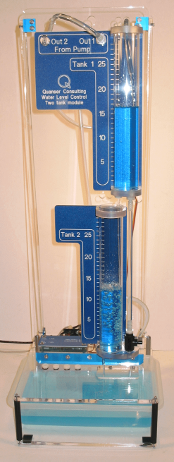

# Theory

 The first step in the analysis of control system is to derive its mathematical model to understand the working of the complete system.

**The Plant(Coupled-Tank):**

The Coupled-Tank plant is a "Two-Tank" module consisting of a pump with a water basin and two tanks. The two tanks are mounted on the front plate such that flow from the first(i.e. upper) tank can flow, through an outlet orifice located at the bottom of the tank, into the second (i.e. lower) tank. Flow from the second tank flows into the main water reservoir. The pump thrusts water vertically to two quick-connect orifices "Out1" and "Out2". The two system variables are directly measured on the Coupled-Tank rig by pressure
sensors and available for feedback. They are namely the water levels in tanks 1 and 2.Proportional plus-Integral-plus-Feedforward-based water level controller has been used here.the Coupled-Tank system is used in two different configurations, namely configuration-1 and configuration-2. In configuration-1, the control challenge is to track to a desired trajectory the water level in the top tank (i.e. tank-1) from the voltage applied to the pump. The coupled-tank system in configuration-2 is an example of state coupling. In configuration-2,the control challenge is to track to a desired trajectory the water level in the bottom tank (i.e.tank-2) from the water flow coming out of the top tank (i.e. tank-1).
				

				

**Configuration-1:**

In configuration-1, a single-tank system, consisting of the top tank (i.e. tank 1), is considered. The designed closed-loop system is to control the water level (or height) inside tank 1 via the commanded pump voltage. It is based on a Proportional-plus-Integral-plus-Feedforward scheme.In response to a desired ±1-cm square wave level setpoint from tank 1 operating level position, the water height behaviour should satisfy the following design performance requirements:

1. The operating level (a.k.a. equilibrium height), L10, in tank 1 should be as follows:
L10=10 [ cm]

2. The Percent Overshoot should be less than 11%, i.e.:

$$p_{o1} \leq 11\%$$
				
3. The 2% Settling Time should be less than 10 seconds, i.e.:

$$t_{s_1} \leq 10 [ s ]$$

4. The response should have no steady-state error.						

The open loop transfer function of tank-1 for configuration-1(voltage to level) is :
				
$$G_1(s) = \frac{\frac{k_p}{A_{01}}\sqrt{\frac{2L_{10}}{g}}}{s(\frac{A_{1}}{A_{01}}\sqrt{\frac{2L_{10}}{g}})+1}$$

where,

kp = Pump volumetric flow constant
A01= Tank-1 outlet cross sectional area
A1 = Tank-1 inner cross section area
g = Gravitational Constant
L1 = Tank-1 water level
F_{in}= Tank-1 water inflow rate
F_{out}= Tank-1 water outflow rate
L2 = Tank-2 water level
				
This is derived from the nonlinear equation of configuration-1 and linearizing it with respect to an operating point(L10,Vp0)

$$\frac{d(change\ in \ volume\ in\ tank1)}{dt} = F_{in} - F_{out}$$
				
$$\frac{dL_1}{dt}= \frac{k_p V_p}{A_1}- \frac{A_{01}}{A_1}\sqrt{2gL_1}$$ 

Nonlinear equation of tank-1
				
$$f(L_1,V_p)= f(L_{10},V_{p0})+ \frac{\partial f(L_{10},V_{p0})}{\partial{L_1}}(L_1 - L_{10})+ \frac{\partial f(L_{10},V_{p0})}{\partial{V_p}}(V_p - V_{p0})$$

taylor series linearization

For zero steady-state error, tank 1 water level is controlled by means of a Proportional-plus-Integral (PI) closed-loop scheme with the addition of a feedforward action,as illustrated in Figure below.The voltage feedforward action is characterized by:
				
$$V_ff = k_ff \sqrt{Lr_1}$$
				
$$V_p = V_ff+ V_{p1}$$

The feedforward gain Kff_1 does not influence the system characteristic equation.Therefore, the feedforward action can be neglected for the purpose of determining the denominator of the closed-loop transfer function.
				

				

				
**Configuration-2:**

In configuration-2, the pump feeds into tank 1, which in turn feeds into tank 2. It is based on a Proportional-plus-Integral-plus-Feedforward scheme.The input to the tank 2 process is the water level, L1, in tank 1 (generating the outflow feeding tank 2) and its output is the water level, L2, in tank 2 (i.e. bottom tank).

In response to a desired ±1-cm square wave level setpoint from tank 2 operating level position, the water height behaviour should satisfy the following design performance requirements:

1. The operating level (a.k.a. equilibrium height), L20, in tank 2 should be as follows:

L20=8 [ cm]

2. The Percent Overshoot should be less than 10%, i.e.:

$$p_{o2} \leq 10\%$$
				
3. The 2% Settling Time should be less than 20 seconds, i.e.:

$$t_{s_2} \leq 20 [ s ]$$

4. The response should have no steady-state error.						

The open loop transfer function of tank-2 for configuration-2(level to level) is :
				
$$G_2(s) = \frac{\frac{A_{01}}{A_{02}}\sqrt{\frac{L_{20}}{L_{10}}}}{s(\frac{A_{2}}{A_{02}}\sqrt{\frac{2L_{20}}{g}})+1}$$

where,

A02= Tank-2 outlet cross sectional area
A2 = Tank-2 inner cross section area
A01= Tank-1 outlet cross sectional area
A1 = Tank-1 inner cross section area
g = Gravitational Constant
L1 = Tank-1 water level
F_{in}= Tank-1 water inflow rate
F_{out}= Tank-1 water outflow rate
L2 = Tank-2 water level
				
This is derived from the nonlinear equation of configuration-2 and linearizing it with respect to an operating point(L20,L10)
				
$$\frac{d(change\ in \ volume\ in\ tank2)}{dt} = F_{in} - F_{out}$$
				
$$\frac{dL_2}{dt}= \frac{A_01\sqrt{2gL_1}}{A_2}- \frac{A_{02}}{A_2}\sqrt{2gL_2}$$ 

Nonlinear equation of tank-2
				
$$f(L_2,L_1)= f(L_{20},L_{10})+ \frac{\partial f(L_{20},L_{10})}{\partial{L_2}}(L_2 - L_{20})+ \frac{\partial f(L_{20},L_{10})}{\partial{L_1}}(L_1 - L_{10})$$

taylor series linearization

For zero steady-state error, tank 2 water level is controlled by means of a Proportional-plus-Integral (PI) closed-loop scheme with the addition of a feedforward action,as illustrated in Figure below.The level feedforward action is characterized by:
				
$$L_{ff_1} = k_{ff_2}L{r_2}$$
				
$$L_{r_1} = L_{11}+ L_{ff_1}$$
				

				

						
								